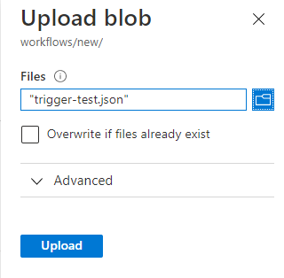
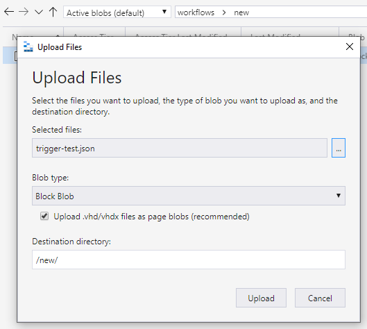

# Overview
This quickstart describes how to deploy Cromwell on Azure and run a sample workflow. 

The main steps are:
1. **Deploy.** Download prerequisites and use the deployment executable to configure the Azure resources needed to run Cromwell on Azure .
1. **Prepare your workflow.** Create a JSON trigger file with required URLs for your workflow.
1. **Execute.** Upload the trigger file so that Cromwell starts running your workflow.

# Deployment
## Prerequisites
1. You will need an [Azure Subscription](https://portal.azure.com/) to deploy Cromwell on Azure, if you don't already have one.
1. You must have the proper [Azure role assignments](https://docs.microsoft.com/en-us/azure/role-based-access-control/overview) to deploy Cromwell on Azure.  You must have one of the following combinations of [role assignments](https://docs.microsoft.com/en-us/azure/role-based-access-control/built-in-roles):
   1. `Owner` of the subscription<br/>
   1. `Contributor` and `User Access Administrator` of the subscription
   1. `Owner` of the resource group.
      1. *Note: this level of access will result in a warning during deployment, and will not use the latest VM pricing data.</i>  [Learn more](https://github.com/microsoft/CromwellOnAzure/blob/master/docs/troubleshooting-guide.md#dynamic-cost-optimization-and-ratecard-api-access)*
1. Install the [Azure Command Line Interface (az cli)](https://docs.microsoft.com/en-us/cli/azure/?view=azure-cli-latest), a command line experience for managing Azure resources.
1. Run `az login` to authenticate with Azure


## Download the deployment executable
1. Download the required executable from [GitHub releases](https://github.com/microsoft/CromwellOnAzure/releases). Choose the runtime of your choice from `win-x64`, `linux-x64`, `osx-x64`
   1. *Optional: build the executable yourself.  Clone the [Cromwell on Azure repository](https://github.com/microsoft/CromwellOnAzure) and build the solution in Visual Studio 2019. Note that [VS 2019](https://visualstudio.microsoft.com/vs/) and [.NET Core SDK 3.0 and 2.2.x](https://dotnet.microsoft.com/download/dotnet-core) are required prerequisites. Build and [publish](https://docs.microsoft.com/en-us/dotnet/core/tools/dotnet-publish?tabs=netcore21#synopsis) the solution (remember to use the correct runtime identifier) to produce the executable*

## Run the deployment executable
#### 
1. **Linux and OS X only**: assign execute permissions to the file by running the following command on the terminal:<br/>
`chmod +x <fileName>`
   1. Replace `<fileName>` with the correct name: `deploy-cromwell-on-azure-linux` or `deploy-cromwell-on-azure-osx.app`
1. You must specify the following parameters:
   1. `SubscriptionId` (**required**)
      1.  This can be obtained by navigating to the [subscriptions blade in the Azure portal](https://portal.azure.com/#blade/Microsoft_Azure_Billing/SubscriptionsBlade)
   1. `RegionName` (**required**)
      1. Specifies the region you would like to use for your Cromwell on Azure instance. To find a list of all available regions, run `az account list-locations` on the command line or in PowerShell and use the desired region's "name" property for `RegionName`.
   1. `MainIdentifierPrefix` (*optional*)
      1. This string will be used to prefix the name of your Cromwell on Azure resource group and associated resources. If not specified, the default value of "coa" followed by random characters is used as a prefix for the resource group and all Azure resources created for your Cromwell on Azure instance. After installation, you can search for your resources using the `MainIdentifierPrefix` value.<br/>

Run the following at the command line or terminal after navigating to where your executable is saved:
```
.\deploy-cromwell-on-azure.exe --SubscriptionId <Your subscription ID> --RegionName <Your region> --MainIdentifierPrefix <Your string> 
```

**Example:**
```
.\deploy-cromwell-on-azure.exe --SubscriptionId 00000000-0000-0000-0000-000000000000 --RegionName westus2 --MainIdentifierPrefix coa 
```

Deployment can take up to 20 minutes to complete.

## Cromwell on Azure deployed resources
Once deployed, Cromwell on Azure configures the following Azure resources:

* [Host VM](https://azure.microsoft.com/en-us/services/virtual-machines/) - The host VM runs the Cromwell server.  It includes the virtual machine, disk, network interface, public IP address, and virtual network. 
* [Batch account](https://docs.microsoft.com/en-us/azure/batch/) - The Batch account is connected to the host VM by default and will spin up the virtual machines that run each task in a workflow.  After deployment, create an Azure support request to increase your core quotas if you plan on running large workflows.  [Learn more here](https://docs.microsoft.com/en-us/azure/batch/batch-quota-limit#resource-quotas).
* [Storage account](https://docs.microsoft.com/en-us/azure/storage/) - This Storage account is mounted to the host VM. By default, it includes the following Blob containers - "cromwell-executions", "cromwell-workflow-logs", "inputs", "outputs", and "workflows".
* [Application Insights](https://docs.microsoft.com/en-us/azure/azure-monitor/app/app-insights-overview) - This contains all logs from the workflow to enable debugging at the task level. 
* [Cosmos DB](https://docs.microsoft.com/en-us/azure/cosmos-db/introduction) - This database includes information and metadata about each task in each workflow run by the host VM.

 All of these resources will be grouped under a single resource group in your account, which you can view on the [Azure Portal](https://portal.azure.com). Note that your specific resource group name, host VM name and host VM password for username "vmadmin" are printed to the screen during deployment. You can store these for your future use, or you can reset the VM's password at a later date via the Azure Portal.<br/>

Note that as part of the Cromwell on Azure deployment, a "Hello World" workflow is automatically run. The input files for this workflow are found in the "inputs" container, and the output files can be found in the "cromwell-executions" container.<br/>

If you expect to run at scale, you will likely want to increase your Azure Batch quota after deployment.  [Learn more here.](https://docs.microsoft.com/en-us/azure/batch/batch-quota-limit#resource-quotas)

# Run a sample workflow
To run a workflow using Cromwell on Azure, you will need to upload your input files and your WDL file to Azure Storage. You will also need to generate a Cromwell on Azure-specific trigger file which includes the path to your WDL and inputs file, and any workflow options and dependencies. Submitting this trigger file initiates the Cromwell workflow. In this example, we will run a sample workflow written in WDL that converts FASTQ files to uBAM for chromosome 21.

## Access input data 
You can find publicly available paired end reads for chromosome 21 hosted here:

[https://msgenpublicdata.blob.core.windows.net/inputs/chr21/chr21.read1.fq.gz](https://msgenpublicdata.blob.core.windows.net/inputs/chr21/chr21.read1.fq.gz)
[https://msgenpublicdata.blob.core.windows.net/inputs/chr21/chr21.read2.fq.gz](https://msgenpublicdata.blob.core.windows.net/inputs/chr21/chr21.read2.fq.gz)

You can use these input files directly as they are publicly available.<br/>

Alternatively, you can choose to upload the data into the "inputs" container in your Cromwell on Azure storage account associated with your host VM.
You can do this directly from the Azure Portal, or use various tools including [Microsoft Azure Storage Explorer](https://azure.microsoft.com/features/storage-explorer/), [blobporter](https://github.com/Azure/blobporter), or [AzCopy](https://docs.microsoft.com/azure/storage/common/storage-use-azcopy?toc=%2fazure%2fstorage%2fblobs%2ftoc.json). <br/>

## Get inputs JSON and WDL files
You can find an inputs JSON file and a sample WDL for converting FASTQ to uBAM format in this [GitHub repo](https://github.com/microsoft/CromwellOnAzure/blob/master/samples/quickstart). The chr21 FASTQ files are hosted on the public Azure Storage account container.<br/>
You can use the "msgenpublicdata" storage account directly as a relative path, like the below example.<br/>

The inputs JSON file should contain the following:
```
{
  "FastqToUbamSingleSample.sample_name": "chr21",
  "FastqToUbamSingleSample.library_name": "Pond001",
  "FastqToUbamSingleSample.group_name": "GrA",
  "FastqToUbamSingleSample.platform": "illumina",
  "FastqToUbamSingleSample.platform_unit": "GrA.chr21",
  "FastqToUbamSingleSample.fastq_pair": [
    "/msgenpublicdata/inputs/chr21/chr21.read1.fq.gz",
    "/msgenpublicdata/inputs/chr21/chr21.read2.fq.gz"
  ]
}
```

The input path consists of 3 parts - the storage account name, the blob container name, file path with extension. Example file path for an "inputs" container in a storage account "msgenpublicdata" will look like
`"/msgenpublicdata/inputs/chr21/chr21.read1.fq.gz"`

If you chose to host these files on your own Storage account, replace the name "msgenpublicdata/inputs" to your `<storageaccountname>/<containername>`. <br/>
 
Alternatively, you can use http or https paths for your input files [using shared access signatures (SAS)](https://docs.microsoft.com/en-us/azure/storage/common/storage-sas-overview) for files in a private Azure Storage account container or refer to any public file location. 

*Please note, [Cromwell engine currently does not support http(s) paths](https://github.com/broadinstitute/cromwell/issues/4184#issuecomment-425981166) in the JSON inputs file that accompany a WDL. **Ensure that your workflow WDL does not perform any WDL operations/input expressions that require Cromwell to download the http(s) inputs on the host machine.***

## Configure your Cromwell on Azure trigger file
Cromwell on Azure uses a JSON trigger file to note the paths to all input information and to initiate the workflow. [A sample trigger file can be downloaded from this GitHub repo](https://github.com/microsoft/CromwellOnAzure/blob/master/samples/quickstart/FastqToUbamSingleSample.chr21.json) and includes the following information:
- The "WorkflowUrl" is the url for your WDL file. You can get this from the Azure Portal.
- The "WorkflowInputsUrl" is the url for your input JSON file.
- The "WorkflowOptionsUrl" is only used with some WDL files. If you are not using it set this to `null`.
- The "WorkflowDependenciesUrl" is only used with some WDL files. If you are not using it set this to `null`.

Your trigger file should be configured as follows:
```
{
 "WorkflowUrl": <URL path to your WDL in quotes>,
 "WorkflowInputsUrl": <URL path to your input json in quotes>,
 "WorkflowOptionsUrl": null,
 "WorkflowDependenciesUrl": null
}
```

When using WDL and inputs JSON file hosted on your private Azure Storage account's blob containers, the specific URL can be found by clicking on the file to view the blob's properties from the Azure portal. The URL path to "WorkflowUrl" for a test WDL file will look like:
`https://<storageaccountname>.blob.core.windows.net/inputs/test/test.wdl`

Alternatively, you can use any http or https path to a TES compliant WDL and inputs.json [using shared access signatures (SAS)](https://docs.microsoft.com/en-us/azure/storage/common/storage-sas-overview) for files in a private Azure Storage account container or refer to any public file location. 

You can also host your WDL and JSON inputs files on your storage account container and use the `/<storageaccountname>/<containername>/blobName` format.

## Start a WDL workflow
To start a WDL workflow, go to your Cromwell on Azure Storage account associated with your host VM. In the `workflows` container, place the trigger file in the "new" virtual directory (note: virtual directories do not exist on their own, they are just part of a blob's name). This initiates a Cromwell workflow, and returns a workflow ID that is appended to the trigger JSON file name and transferred to the "inprogress" directory in the `workflows` container.<br/>

This can be done programatically using the [Azure Storage SDKs](https://azure.microsoft.com/en-us/downloads/), or manually via the [Azure Portal](https://portal.azure.com) or [Azure Storage Explorer](https://azure.microsoft.com/en-us/features/storage-explorer/).

### Via the Azure Portal
<br/>

### Via Azure Storage Explorer


For example, a trigger JSON file with name `task1.json` in the "new" directory, will be move to "inprogress" directory with a modified name `task1.guid.json`. This guid is a workflow id assigned by Cromwell.<br/>

Once your workflow completes, you can view the output files of your workflow in the `cromwell-executions` container within your Azure Storage Account. Additional output files from the cromwell endpoint, including metadata and the timing file, are found in the `outputs` container. To learn more about Cromwell's metadata and timing information, visit the [Cromwell documentation](https://cromwell.readthedocs.io/en/stable/).<br/>

## Abort an in-progress workflow
To abort a workflow that is in-progress, go to your Cromwell on Azure Storage account associated with your host VM. In the `workflows` container, place an empty file in the "abort" virtual directory named `cromwellID.json`, where "cromwellID" is the Cromwell workflow ID you wish to abort.
