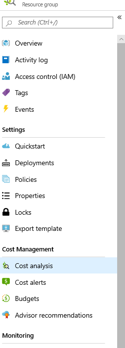
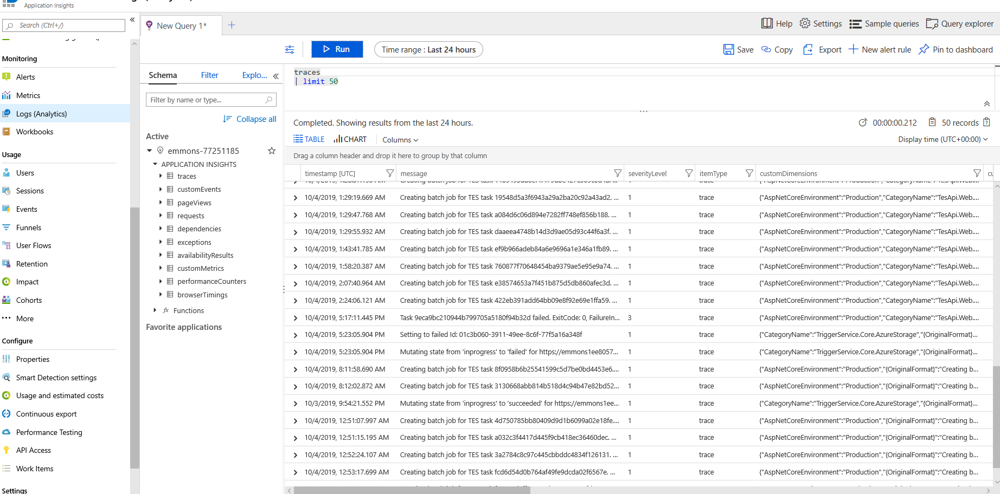
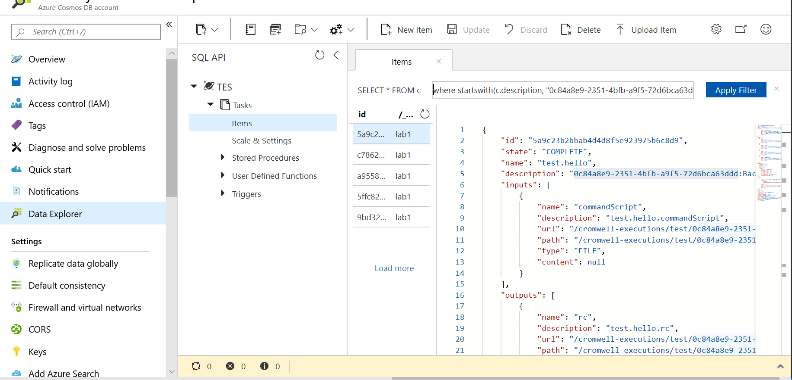

# FAQ and Troubleshooting guide
This article lists common questions and troubleshooting tips for using Cromwell on Azure.

## How to prepare files to run a workflow on Cromwell on Azure
For any pipeline, you can create a [WDL](https://software.broadinstitute.org/wdl/) file that calls your tools in docker containers. Please note that Cromwell on Azure only supports tasks with docker containers defined for security reasons.<br/>
For specifying inputs to any workflow, you may want to use a JSON file that allows you to customize inputs to any workflow WDL file.<br/>

For files hosted on an Azure Storage account, the input path consists of 3 parts - the storage account name, the blob container name, file path with extension. Example file path for an "inputs" container in a storage account "msgenpublicdata" will look like
`"/msgenpublicdata/inputs/chr21.read1.fq.gz"`

Example WDL file:
```
task hello {
  String name

  command {
    echo 'Hello ${name}!'
  }
  output {
	File response = stdout()
  }
  runtime {
	docker: 'ubuntu:16.04'
  }
}

workflow test {
  call hello
}
```

Example inputs.json file:
```
{
  "test.hello.name": "World"
}
```

## How to define the runtime attributes in a WDL workflow for Cromwell on Azure
In order to run a WDL file, you must modify/create a workflow with the following runtime attributes for the tasks that are compliant with the [TES or Task Execution Schemas](https://cromwell.readthedocs.io/en/develop/backends/TES/):

```
runtime {
    cpu: 1
    memory: 2 GB
    disk: 10 GB
    docker:
    maxRetries: 0
}
```
Ensure that the attributes `memory` and `disk` (note: use the singular form for `disk` NOT `disks`) have units. Supported units from Cromwell:

> KB - "KB", "K", "KiB", "Ki"<br/>
> MB - "MB", "M", "MiB", "Mi"<br/>
> GB - "GB", "G", "GiB", "Gi"<br/>
> TB - "TB", "T", "TiB", "Ti"<br/>

`preemptible` and `zones` attributes are currently not being passed through Broad's Cromwell to the TES backend, and hence are not supported.<br/>
Each of these runtime attributes are specific to your workflow and tasks within those workflows. The default values for resource requirements are as set above.<br/>
Learn more about Cromwell's runtime attributes [here](https://cromwell.readthedocs.io/en/develop/RuntimeAttributes).

## How to get the Cromwell workflow ID
The Cromwell workflow ID is generated by Cromwell once the workflow is in progress, and it is appended to the trigger JSON file name.<br/>

For example, placing a trigger JSON file with name `task1.json` in the "new" directory will initiate the workflow.  Once the workflow begins, the JSON file will be moved to the "inprogress" directory in the "workflows" container with a modified name `task1.guid.json`

## How to abort a workflow when using Cromwell on Azure
To abort a workflow, upload an empty JSON file to the "workflows" container named `abort/ID.json` where ID is the Cromwell workflow ID.

## Pricing for Cromwell on Azure
To learn more about your Resource Group's cost, navigate to the "Cost Analysis" menu item in the "Cost Management" section of your Azure Resource Group on Azure Portal. More information [here](https://docs.microsoft.com/en-us/azure/cost-management/quick-acm-cost-analysis).<br/>


You can also use the [Pricing Calculator](https://azure.microsoft.com/en-us/pricing/calculator/) to estimate your monthly cost.

## Dynamic cost optimization and RateCard API access
VM price data is used to select the most cost-effective VM for a task's runtime requirements, and is also stored in the TES database to allow calculation of total workflow cost.  VM price data is obtained from the [Azure RateCard API](https://docs.microsoft.com/en-us/previous-versions/azure/reference/mt219005(v=azure.100)).  Accessing the Azure RateCard API requires the VM's Billing Reader role to be assigned to your Azure subscription scope.  If you don't have Owner or Contributor role access to your subscription, the deployer will not be able to complete this on your behalf - you will need to contact your Azure subscription's owner or contributor to complete this for you.  You will see a warning in the TES logs indicating that default VM prices are being used until this is resolved.

## Debugging tools
### How to check all tasks running for a workflow using Batch account
Each task in a workflow starts an Azure Batch node. To see currently active tasks, navigate to your Azure Batch instance on Azure Poetal. Click on "Jobs" and then search for the Cromwell `workflowId` to see all tasks associated with a workflow.<br/>


### How to use Application Insights
When working with Cromwell on Azure, you may run into issues with Azure Batch or Storage accounts. For instance, if a file path cannot be found or if the WDL workflow failed with an unknown reason. For these scenarios, consider debugging or collecting more information using [Application Insights](https://docs.microsoft.com/en-us/azure/azure-monitor/app/app-insights-overview).<br/>

Navigate to your Application Insights instance on Azure Portal. Click on the "Logs (Analytics)" menu item under the "Monitoring" section to get all logs from Cromwell on Azure's TES backend.<br/>



You can explore exceptions or logs to find the reason for failure, and use time ranges or [Kusto Query Language](https://docs.microsoft.com/en-us/azure/kusto/query/) to narrow your search.<br/>

### How to use Cosmos DB
[Cosmos DB](https://azure.microsoft.com/en-us/services/cosmos-db/) stores information about all tasks in a workflow. For monitoring or debugging any workflow you may choose to query the database.<br/>

Navigate to your Cosmos DB instance on Azure Portal. Click on the "Data Explorer" menu item, Click on the "TES" container and select "Items". <br/>



You can write a [SQL query](https://docs.microsoft.com/en-us/azure/cosmos-db/tutorial-query-sql-api) to get all tasks in a workflow using the following query, replacing `workflowId` with the id returned from Cromwell for your workflow:
```
SELECT * FROM c where startswith(c.description,"workflowId")
```

OR
```
SELECT * FROM c where startswith(c.id,"<first 9 character of the workflowId>")
```


